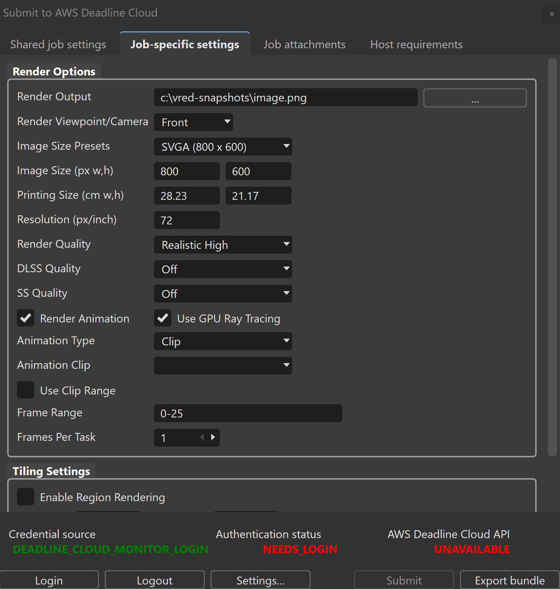
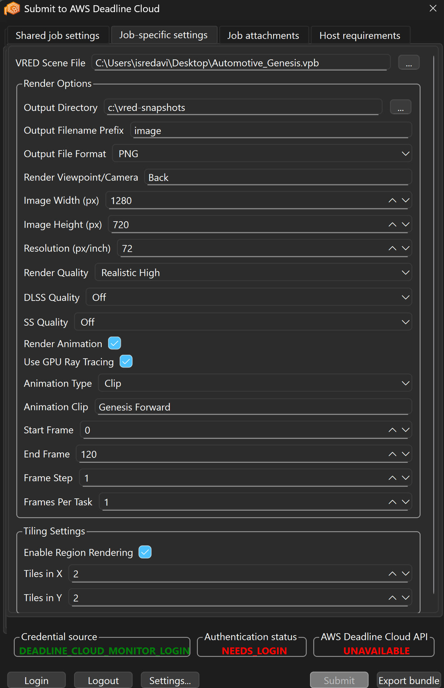

# AWS Deadline Cloud for VRED

[](https://pypi.python.org/pypi/deadline-cloud-for-vred)
[](https://pypi.python.org/pypi/deadline-cloud-for-vred)
[](https://github.com/aws-deadline/deadline-cloud-for-vred/blob/mainline/LICENSE)

AWS Deadline Cloud for VRED is a Python-based package that supports creating and running Autodesk VRED render jobs
within [AWS Deadline Cloud][deadline-cloud]. It provides a user-friendly VRED submitter plug-in for your Windows-based
workstation, where you can choose from a set of common render options and offload the computation of your rendering
workloads to [AWS Deadline Cloud][deadline-cloud] to free up local compute resources for other tasks.

[deadline-cloud]: https://docs.aws.amazon.com/deadline-cloud/latest/userguide/what-is-deadline-cloud.html

[deadline-cloud-client]: https://github.com/aws-deadline/deadline-cloud

[deadline-cloud-for-vred]: https://github.com/aws-deadline/deadline-cloud-for-vred

[openjd]: https://github.com/OpenJobDescription/openjd-specifications/wiki

[service-managed-fleets]: https://docs.aws.amazon.com/deadline-cloud/latest/userguide/smf-manage.html

[default-queue-environment]: https://docs.aws.amazon.com/deadline-cloud/latest/userguide/create-queue-environment.html#conda-queue-environment

[vred-requirements]: https://www.autodesk.com/support/technical/article/caas/sfdcarticles/sfdcarticles/System-requirements-for-Autodesk-VRED-2026-products.html

## Compatibility

The Deadline Cloud for VRED package requires:

1. VRED Pro or VRED Core 2025/2026 and its [vred-requirements]
2. Python 3.11 or higher;
3. Operating System support:
    - Windows 10+ (for the in-app VRED Submitter, Worker, Standalone Deadline Cloud console-mode submitter)
    - Linux (for the Worker, Standalone Deadline Cloud console-mode submitter)
    - macOS (for the Standalone Deadline Cloud console-mode submitter)
4. Optionally: [ImageMagick](https://imagemagick.org/) (for tile assembly when using region rendering with raytracing
   applied).

**Important**: This integration of Deadline Cloud into VRED requires **bring your own licensing (BYOL)** for VRED. You
must have valid VRED licenses available for your render farm fleet.

## Versioning

This package's version follows [Semantic Versioning 2.0](https://semver.org/), but it is still considered to be in its
initial development, thus backwards incompatible versions are denoted by minor version bumps. To help illustrate how
versions will increment during this initial development stage, they are described below:

1. The MAJOR version is currently 0, indicating initial development.
2. The MINOR version is currently incremented when backwards incompatible changes are introduced to the public API.
3. The PATCH version is currently incremented when bug fixes or backwards compatible changes are introduced to the
   public API.

## Getting Started

This VRED integration for AWS Deadline Cloud provides an in-app submitter plug-in that must be installed on the
Windows workstation that you will use to submit render jobs.

Before submitting any large, complex, or otherwise compute-heavy VRED render jobs to your farm, we strongly
recommend that you construct a simple test scene file that can be rendered quickly and submit renders of that scene
to your render farm fleet to ensure that its setup is correctly functioning.

### VRED Submitter Plug-in

The VRED submitter plug-in creates a menu (Deadline Cloud) and menu item (Submit to Deadline Cloud) in your VRED
menu bar, which can be used to submit render jobs to AWS Deadline Cloud. This menu item launches a Submitter UI to
create a job submission for AWS Deadline Cloud using the [AWS Deadline Cloud client library][deadline-cloud-client].
It  
automatically determines the files required for submission based on the loaded scene (including Source/Smart
references.) Additionally, the Submitter provides basic render options (in the Job-specific settings tab), and
builds an [Open Job Description template] [openjd] that defines the render pipeline workflow. From there, the
Submitter submits the render job to the render farm queue and fleet of your choice.

#### Prerequisites

1. Install the required applications:
    - VRED Pro 2025/2026 [Autodesk](https://manage.autodesk.com)
    - [Deadline Cloud Client][deadline-cloud-client]
    - [Deadline Cloud Monitor](https://docs.aws.amazon.com/deadline-cloud/latest/userguide/open-deadline-cloud-monitor.html)

2. Open Deadline Cloud Monitor and perform sign-in on an appropriate profile (see instructions below).

#### Submitter Installation

1. Fetch the latest Deadline Cloud for VRED code:
   ```bash
   git clone https://github.com/aws-deadline/deadline-cloud-for-vred
   cd deadline-cloud-for-vred
   # For updates: git fetch
   ```

2. Install the Submitter plug-in (if not using an installer):
    - Create submitter installation directories:
   ```cmd
   mkdir C:\DeadlineCloudSubmitter\Submitters\VRED\scripts\deadline
   # or
   mkdir %USERPROFILE%\DeadlineCloudSubmitter\Submitters\VRED\scripts\deadline
   ```
    - Copy `vred_submitter_plugin/plug-ins/DeadlineCloudForVRED.py` to VRED's Python libraries directory:
        - For VRED Core: `C:\Program Files\Autodesk\VREDCore-18.0\lib\python\Lib\site-packages`
        - For VRED Pro: `C:\Program Files\Autodesk\VREDPro-18.0\lib\python\Lib\site-packages`
    - Copy `src/deadline/vred_submitter` to your Deadline Cloud submitter directory:
      `C:\DeadlineCloudSubmitter\Submitters\VRED\scripts\deadline` or
      `%USERPROFILE%\DeadlineCloudSubmitter\Submitters\VRED\scripts\deadline`

3. Set environment variables (examples for VRED Pro and VRED Core 2026):
   ```cmd
   # For VRED Core
   setx VREDCORE "C:\Program Files\Autodesk\VREDCore-18.0\bin\WIN64\VREDCore.exe"
   # or for VRED Pro
   setx VREDPRO "C:\Program Files\Autodesk\VREDPro-18.0\bin\WIN64\VREDPro.exe"
   ```

5. Supply AWS account credentials for the submitter to use when submitting a render job through either of these steps:
    - [Install and set up the Deadline Cloud Monitor][deadline-cloud-monitor-setup], and then log in to the monitor.
      (Logging in to the monitor will make AWS credentials available to the submitter, automatically.)
    - Set up an AWS credentials profile [as you would for the AWS CLI][aws-cli-credentials], and select that profile
      for the submitter to use.
    - Or default to your AWS EC2 instance profile credentials if you are running a workstation in the cloud.

6. Configure the VRED Submitter plug-in to load on startup.
    - Start VRED Pro and click on these items: Edit menu → Preferences → General Settings → Script
    - In the Script section, scroll to the bottom and append:
      ```python
      from DeadlineCloudForVRED import DeadlineCloudForVRED
      DeadlineCloudForVRED()
      ```
    - Click the "Save" button

7. Logout and login to refresh environment variables.

8Optional (if Deadline Cloud Python installation is missing): copy another Submitter's Python installation:

- Example: copy the `Python` directory from your Blender submitter installation:
  ```cmd
  # From C:\DeadlineCloudSubmitter\Submitters\Blender\Python to:
  # C:\DeadlineCloudSubmitter\Submitters\VRED\Python
  # or from %USERPROFILE%\DeadlineCloudSubmitter\Submitters\Blender\Python to:
  # %USERPROFILE%\DeadlineCloudSubmitter\Submitters\VRED\Python

    ```

9Optional (NOT recommended, since Deadline Cloud requires network and file access): Configure VRED Python Sandbox:
- Start VRED Pro and click on these items: Edit menu → Preferences → General Settings → Script
- In the Python Sandbox section, ensure that "Enable Python Sandbox" is enabled
- Copy the contents of `python-sandbox-module-allowlist.txt` from this repository into the "Allowed Modules" text
box
- Click the "Save" button

[deadline-cloud-monitor-setup]: https://docs.aws.amazon.com/deadline-cloud/latest/userguide/submitter.html#install-deadline-cloud-monitor

[aws-cli-credentials]: https://docs.aws.amazon.com/cli/v1/userguide/cli-chap-authentication.html

#### Launch Instructions

1. Open VRED.
2. Open a VRED scene file.
3. Open the Deadline Cloud menu and click the "Submit to Deadline Cloud" menu item to launch the Submitter.

   **Note**: If you have not already authenticated with Deadline Cloud, the "Authentication Status" section at the
   bottom of the Submitter will show "NEEDS_LOGIN".

   3a) Click the Login button. Then, in the web browser window that appears, log in with your IAM user credentials.

   3b) Click the Allow button (your login will then be authenticated and the "Authentication Status" section will show "
   AUTHENTICATED").

4. In the "Submit to AWS Deadline Cloud" dialog, configure appropriate settings (including the render settings listed in
   the "Job-specific settings" tab).
5. Click the Submit button to submit your render job to Deadline Cloud.

### VRED Software Availability in AWS Deadline Cloud Service Managed Fleets

You will need to ensure that the version of VRED that you want to run is available on the worker host when you are using
AWS Deadline Cloud's [Service Managed Fleets][service-managed-fleets] to run jobs; these hosts do not have any rendering
applications pre-installed, unless provided. The standard way of achieving this is described [in the service
documentation] (https://docs.aws.amazon.com/deadline-cloud/latest/developerguide/provide-applications.html).

**Licensing Requirements**: VRED requires valid BYOL licenses on all worker nodes. You must configure your license
server to be accessible from your render farm, ensuring that licenses are available for concurrent rendering tasks.

### ImageMagick Installation

For jobs using region rendering (tiling), ImageMagick must be installed on the worker nodes:

#### Windows

1. Download ImageMagick from [https://imagemagick.org/script/download.php](https://imagemagick.org/script/download.php)
2. Install the 64-bit static binary release
3. Set the `MAGICK` environment variable:
   ```cmd
   setx MAGICK "C:\Program Files\ImageMagick-7.1.1-Q16\magick.exe"
   ```

#### Linux

**Important**: Use a static ImageMagick binary to missing file format decoder dependency issues:

```bash
wget https://imagemagick.org/archive/binaries/magick
chmod 755 magick
yum install fontconfig libX11 fribidi  # or dnf install fontconfig libX11 fribidi
```

You can add these steps to an existing Conda package, or make another one and reference in render job submissions.

**Note**: Without ImageMagick, tile assembly will fail and region rendering jobs will not complete successfully.

### Worker Setup (Optional)

To set up a worker for your own farm:

1. Create your own farm in the AWS Console - Deadline Cloud. Note the farm ID and fleet ID, AWS region.

2. Install worker:
   ```bash
   pip install deadline-cloud-worker-agent
   ```

3. Configure worker in `C:\ProgramData\Amazon\Deadline\Config\worker.toml` (substituting the field values below):
   ```toml
   farm_id = "farm-aabbccddeeff11223344556677889900"
   fleet_id = "fleet-aabbccddeeff11223344556677889900"
   profile = "my_aws_profile_name"
   worker_logs_dir = "c:/users/username/desktop"
   
   [capabilities.amounts]
   "amount.attr.worker.gpu" = 1
   ```

4. Switch to the AWS profile used to create the farm.

5. Create a batch file `run-worker.bat` to continually re-run worker agent:
   ```batch
   :do
   python -m deadline_worker_agent --run-jobs-as-agent-user
   goto do
   ```

6. Install ImageMagick (latest 64-bit static release)
   from [https://imagemagick.org/script/download.php](https://imagemagick.org/script/download.php)

7. Set MAGICK environment variable:
   ```cmd
   setx MAGICK "C:\Program Files\ImageMagick-7.1.1-Q16\magick.exe"
   ```

8. Run the worker: `run-worker.bat`

## Submitter Interfaces

The VRED submitter provides a comprehensive interface for configuring render jobs.

### In-App (inside of VRED) Submitter



### Standalone (outside of VRED, command line) Submitter



The standalone submitter is invoked via command line with environment variables:

```bash
# Windows
set FARM_ID=farm-<farm-id>
set QUEUE_ID=queue-<queue-id>
set FLEET_ID=fleet-<fleet-id>
deadline bundle gui-submit .

# Linux
export FARM_ID=farm-<farm-id>
export QUEUE_ID=queue-<queue-id>
export FLEET_ID=fleet-<fleet-id>
deadline bundle gui-submit .
```

The main render options include:

### Render Options

- **Output Directory**: Directory where rendered images will be saved
- **Output Filename Prefix**: Base name for output files (without extension)
- **Output File Format**: Image format (PNG, EXR, JPEG, TIFF, etc.)
- **Render Viewpoint/Camera**: Name of the viewpoint or camera to render from
- **Image Size**: Width and height in pixels with preset options (HD 1080, 4K, etc.)
- **Resolution (DPI)**: Dots-per-inch scaling factor
- **Render Quality**: Quality level (Analytic Low/High, Realistic Low/High, Raytracing, NPR)
- **DLSS Quality**: Deep Learning Super Sampling quality (Off, Performance, Balanced, Quality, Ultra Performance)
- **SS Quality**: Super Sampling quality (Off, Low, Medium, High, Ultra High)
- **Use GPU Ray Tracing**: Enable GPU-accelerated raytracing if hardware supports it

### Animation Options

- **Render Animation**: Enable animation rendering
- **Animation Type**: Choose between Clip or Timeline animation
- **Animation Clip**: Specific animation clip name to render
- **Frame Range**: Start and end frames with optional step size
- **Frames Per Task**: Number of frames rendered per task for job parallelization

### Tiling Settings

- **Enable Region Rendering**: Divide image into tiles for parallel rendering
- **Tiles in X/Y**: Number of horizontal and vertical tiles
- **Tile Assembly**: Automatic combination of tiles into final images

**Important**: Region rendering (tiling) is designed for scene files configured with Raytracing render quality. Using
tiling with other render qualities may result in solid black-rendered output.

## Environment Variables

The following environment variables can be used to configure the submitter:

### Required

- `VREDCORE`: Path to VRED Core executable (takes precedence if both are set)
- `VREDPRO`: Path to VRED Pro executable

### Optional

- `CONDA_CHANNELS`: Override default conda channels for job environments
- `CONDA_PACKAGES`: Override default conda packages (default: `vredcore=2026*`)
- `VRED_DISABLE_WEBINTERFACE`: Disable VRED web interface (enabled automatically by default)
- `VRED_IDLE_LICENSE_TIME`: License release timeout in seconds (set to "60" by default)
- `FLEXLM_DIAGNOSTICS`: FlexLM diagnostic level for licensing (set to "3" by default)

### Required for Tile Assembly

- `MAGICK`: Path to ImageMagick executable (required for region rendering jobs)

## Viewing the Job Bundle that will be submitted

To submit a job, the submitter first generates a [Job Bundle][job-bundle], and then uses functionality from
the [Deadline][deadline-cloud-client] package to submit the Job Bundle to your render farm to run. If you would like to
see the job that will be submitted to your farm, then you can use the "Export Bundle" button in the submitter to export
the Job Bundle to a location of your choice. If you want to submit the job from the export, rather than through the
submitter plug-in then you can use the [Deadline Cloud application][deadline-cloud-client] to submit that bundle to your
farm.

[job-bundle]: https://docs.aws.amazon.com/deadline-cloud/latest/developerguide/build-job-bundle.html

## Troubleshooting

### Common Issues

1. **VRED Not Found**
   ```
   OSError: VRED executable not found
   ```
    - Verify VREDCORE or VREDPRO environment variable
    - Check VRED installation path and permissions

2. **Plugin Load Failed**
   ```
   Failed to load DeadlineCloudForVRED plugin
   ```
    - Ensure plugin file is in correct VRED directory
    - Check Python sandbox configuration
    - Verify module allowlist includes required packages

3. **Asset Reference Issues**
   ```
   AssertionError: asset references don't match
   ```
    - Verify scene file asset dependencies
    - Check asset path resolution
    - Ensure scene file is saved before testing

4. **Black Tile Rendering Output**
   ```
   Rendered tiles appear solid black
   ```
    - Verify scene is configured for Raytracing render quality
    - Region rendering requires Raytracing for proper tile generation
    - Check render quality settings in scene file

4. **Bundle Export Failed**
   ```
   Expected bundle file(s) not found
   ```
    - Verify output directory permissions
    - Check job bundle generation process
    - Ensure scene file is properly saved

5. **Tile Assembly Failed**
   ```
   ImageMagick command failed
   ```
    - Verify ImageMagick is installed and `MAGICK` environment variable is set
    - Check ImageMagick executable permissions
    - Ensure sufficient disk space for tile processing

6. **VRED License Issues**
   ```
   License checkout failed
   ```
    - Verify VRED license server accessibility
    - Check available floating licenses
    - Ensure license server can handle concurrent requests from render farm

### VRED Rendering Issues (Detailed)

1. **Raytraced Renders Appear Black**
    - **Lighting**: Raytracing requires proper light sources - increase light intensity 5-10x or add area lights/HDR
      environment
    - **Materials**: Verify materials have proper diffuse colors and raytracing-compatible properties
    - **Camera**: Check exposure settings and camera position
    - **Quick fix**: Add area light and verify that materials aren't pure black

2. **Render Region Limitations**
    - Render regions only work with raytracing enabled in VRED

## Security

We take all security reports seriously. When we receive such reports, we will investigate and subsequently address any
potential vulnerabilities as quickly as possible. If you discover a potential security issue in this project, please
notify AWS/Amazon Security via
our [vulnerability reporting page](http://aws.amazon.com/security/vulnerability-reporting/) or directly via email
to [AWS Security](aws-security@amazon.com). Please do not create a public GitHub issue in this project.

## Telemetry

See [telemetry](https://github.com/aws-deadline/deadline-cloud-for-vred/blob/release/docs/telemetry.md) for more
information.

## License

This project is licensed under the Apache-2.0 License.