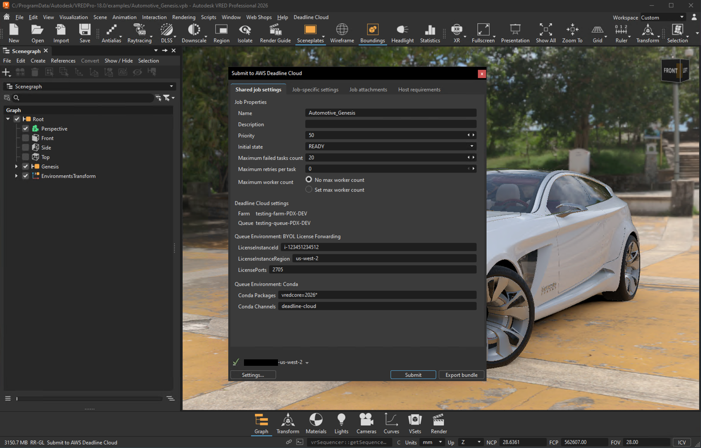

# AWS Deadline Cloud for Autodesk VRED User Guide

This guide walks you through using AWS Deadline Cloud with Autodesk VRED to accelerate your rendering workflow by distributing tasks across multiple machines.

## What's inside

This user guide covers:

- [Installation](installation.md) - How to install the Autodesk VRED submitter
- [Using the Submitter](using-submitter.md) - How to prepare and submit rendering jobs

## Support

Need help or have feedback? Here's how to get support:

- **[Report a bug or issue](https://github.com/aws-deadline/deadline-cloud-for-vred/issues)** - Report a bug or issue with the VRED adapter or submitter
