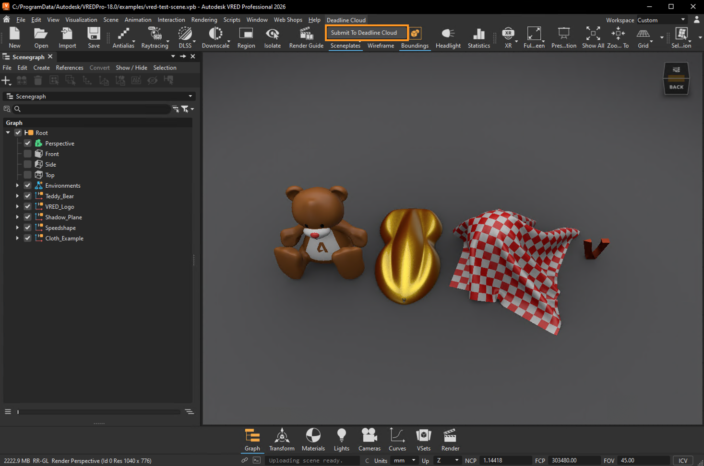
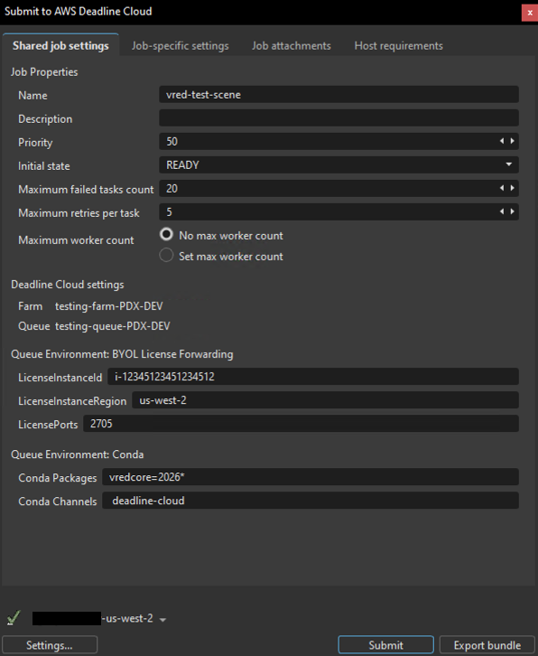
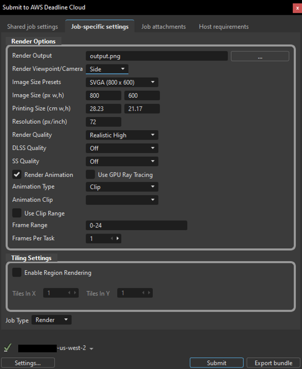

# Using the Autodesk VRED submitter

Before using the Deadline Cloud submitter for VRED, ensure your farm has a VRED-capable fleet configured and the submitter is installed. You also need to authenticate with Deadline Cloud Monitor or provide AWS credentials through a configuration profile.

For submitter installation instructions, see [installation.md](installation.md).

## Submit a job

**To submit a job from VRED to Deadline Cloud**

1. Save your VRED scene file.
1. In VRED's menu bar, choose **Deadline Cloud** > **Submit to Deadline Cloud**.
1. If you have not already authenticated with Deadline Cloud, choose the **Log in** button and authenticate using your credentials in the browser window that appears.
1. Use the tabs in the dialog to customize your job.
1. (Optional) To export a job's associated files to your job history directory without submitting it, choose **Export bundle**.
    - A _job bundle_ is a group of files that defines a job. For more information, see [Open Job Description templates for Deadline Cloud](https://docs.aws.amazon.com/deadline-cloud/latest/developerguide/build-job-bundle.html).
1. Choose **Submit** and follow the prompts to send your job to Deadline Cloud.

## Shared job settings

These settings apply to the entire job:

- **Name** - A descriptive name for your render job
- **Description** - Optional details about your render job
- **Priority** - Job priority for queue management (default: 50)
- **Initial State** - Whether the job starts immediately (READY) or remains paused
- **Maximum failed tasks count** - Maximum tasks that can fail before the job is marked as failed (default: 20)
- **Maximum retries per task** - How many times a failed task will be retried (default: 5)
- **Maximum worker count** - Maximum workers that can process this job simultaneously
- **Farm** - The farm where your job will render
- **Queue** - The specific queue within your chosen farm
- **Conda Packages** - Conda packages for the job environment (automatically configured for your VRED version)
- **Conda Channels** - Conda channels for package resolution

## VRED-specific settings

The **Job-specific settings** tab contains render options specific to VRED:

### Render Options

- **Render Output** - The output file path and base filename for rendered images. Use the browse button (**...**) to select the output directory and specify the filename.
- **Render Viewpoint/Camera** - Select which viewpoint or camera to render from. The dropdown lists all available viewpoints in your scene.
- **Image Size Presets** - Quick selection of common image dimensions (e.g., SVGA 800x600, HD 1080, 4K).
- **Image Size (px w,h)** - Width and height in pixels for the rendered output. These values update automatically when you select a preset, or you can enter custom dimensions.
- **Printing Size (cm w,h)** - Physical print dimensions in centimeters. This value is linked to image size and resolution.
- **Resolution (px/inch)** - Dots-per-inch (DPI) setting that affects the relationship between image size and printing size (default: 72).
- **Render Quality** - Quality preset for rendering. Options include:
    - Analytic Low/High
    - Realistic Low/High
    - Raytracing
    - Non-Photorealistic (NPR)
- **DLSS Quality** - NVIDIA Deep Learning Super Sampling quality level (Off, Performance, Balanced, Quality, Ultra Performance). Requires compatible NVIDIA GPU.
- **SS Quality** - Super Sampling anti-aliasing quality (Off, Low, Medium, High, Ultra High). This setting is overridden when DLSS is enabled.
- **Render Animation** - When enabled, renders an animation sequence instead of a single frame. This reveals additional animation options.
- **Use GPU Ray Tracing** - Enable GPU-accelerated raytracing for higher quality renders. Requires compatible GPU hardware.
- **Animation Type** - Type of animation to render (Clip or Timeline). Visible when **Render Animation** is enabled.
- **Animation Clip** - Select which animation clip to render from the dropdown. Visible when **Animation Type** is set to Clip.
- **Use Clip Range** - When enabled, uses the frame range defined in the selected animation clip.
- **Frame Range** - Start and end frames to render (e.g., "0-24"). You can specify a custom range or use the clip's range.
- **Frames Per Task** - Number of consecutive frames each worker renders per task (default: 1). Higher values improve rendering efficiency by reducing task initialization overhead, but provide less granular progress tracking. For example, with Frames Per Task set to 5, Task 1 renders frames 1-5, Task 2 renders frames 6-10, and so on.

### Tiling Settings

Region rendering (tiling) divides each frame into smaller tiles that render independently as separate tasks, then assembles them into the final image. This can improve performance for large, complex renders.

- **Enable Region Rendering** - Enables tile-based rendering. When enabled, **Use GPU Ray Tracing** is automatically activated.
- **Tiles In X** - Number of horizontal tile divisions (default: 1).
- **Tiles In Y** - Number of vertical tile divisions (default: 1).

**Important**: Region rendering requires **Use GPU Ray Tracing** to be enabled. Scene files must be properly configured for ray tracing (such as having sufficient lighting) to produce correct output. Using region rendering on scenes not set up for ray tracing will produce solid black tiles.

**Tile assembly requirements**: Region rendering requires ImageMagick to be available in the rendering environment for assembling tiles into the final image. One way to provide this on Service Managed Fleets is to add the `imagemagick` conda package (for example, from the `conda-forge` channel) to your Queue Environment. For detailed instructions on configuring conda packages, see [Configure jobs using queue environments](https://docs.aws.amazon.com/deadline-cloud/latest/developerguide/configure-jobs.html).

### Job Type

- **Job Type** - The type of job to submit:
   - **Render** - Renders images or animation frames from the scene (default)
   - **Sequencer** - Executes VRED Sequencer workflows defined in your scene

For information about the other submitter tabs (Job attachments, Host requirements), see the [AWS Deadline Cloud guide for using a submitter](https://docs.aws.amazon.com/deadline-cloud/latest/userguide/jobs-using-submitter.html).

## Monitoring your jobs

You can track your job progress through the Deadline Cloud monitor. For more information, see the [AWS Deadline Cloud guide for using the monitor](https://docs.aws.amazon.com/deadline-cloud/latest/userguide/working-with-deadline-monitor.html).

## Getting help

- Contact AWS Support
- For bugs, please log an [issue on GitHub](https://github.com/aws-deadline/deadline-cloud-for-vred/issues) (requires a GitHub account)
- For feature requests or improvement ideas, please visit our [discussion forum](https://github.com/aws-deadline/deadline-cloud-for-vred/discussions)
